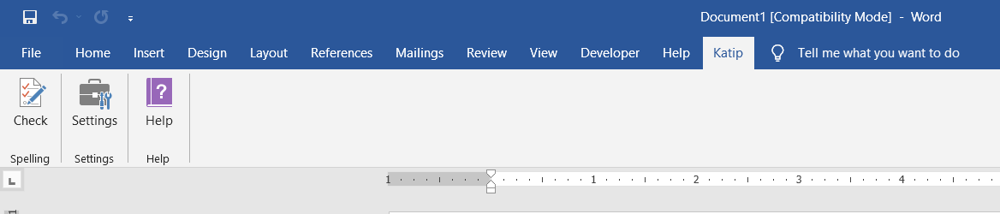
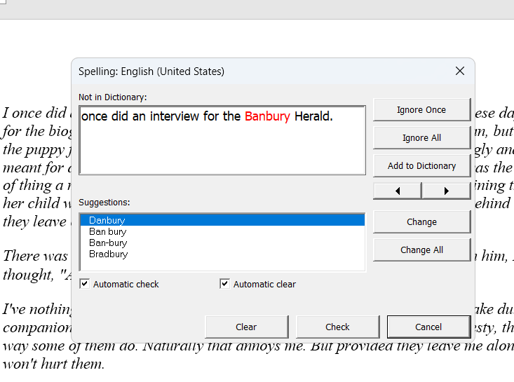
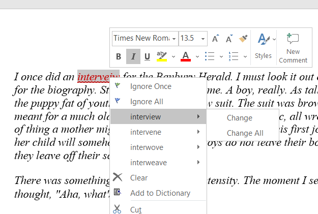
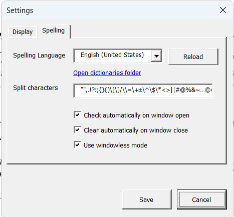

<!-- Google tag (gtag.js) -->

# Introduction

Katip is an add-in designed to enhance spellchecking capabilities in the Microsoft Word desktop application using the Hunspell library and dictionaries.

Many languages around the world lack built-in spellchecking functionality and are not supported by major software vendors. The goal of this add-in is to integrate Hunspell's robust spellchecking features into Microsoft Word, thereby enabling spellchecking for low-resource languages. 

[Hunspell](https://hunspell.github.io/) is a globally used open-source library.

Katip is open-source and is available at Github [Katip](https://github.com/berkesas/Katip4/)

# License

Katip is available under the GPL License. Katip uses [Hunspell](https://github.com/hunspell/hunspell), governed by its respective licenses.

# Installation

To install Katip, you need to determine whether your Word installation (not Windows OS) is 32-bit or 64-bit.

## Determine the Bitness of Your Word Installation

### Word 2010

- Go to **File** > **Help**.
- Look on the right side. You will see text similar to "Version: xx.x.xxx.xxxx (64-bit)".

### Word 2016

- Go to **File** > **Account**.
- Click on **About Word** to find out the bitness.

## Choose the Installation File

- For 32-bit Word, use `katip_setup_x86.exe`.
- For 64-bit Word, use `katip_setup_x64.exe`.

# Using spellchecking functionality

Spellchecking functionality can be used in two modes: Windowed and Windowless modes.

## Windowed mode

Windowed mode is the default setting for spellchecking. It displays a dialogue window to show words that are not found in the current spellchecking dictionary and suggested alternatives. 

To start use Check menu button on Katip ribbon tab.

<figure>
    
    <figcaption>Katip tab on ribbon</figcaption>
</figure>

&nbsp;

The Spellchecking dialogue window opens.

&nbsp;

<figure>
    
    <figcaption>Spelling window</figcaption>
</figure>

The functions of the elements on this window:

- **Not in Dictionary** - This text box displays the current misspelling in its context. The exact misspelling text is indicated in red color. It only means that the word is not found in the loaded dictionary. It may well be that it is a correct spelling of a valid word in the current language. 
- **Suggestions** - This list shows suggestions generated by Hunspell. These suggestions can be used to replace the occurrences of misspellings.

- **Ignore Once** - Ignores the current highlighted misspelling occurrence and resets its style to original color. Ignoring is valid for the active session only. If you re-launch Word it will be listed as a misspelling again.
- **Ignore All** - Ignores the current highlighted misspelling and all other occurrences in the document. Ignoring is valid for the active session only. If you re-launch Word it will be listed as a misspelling again.
- **Add to Dictionary** - Opens the Add Word form to add the selected text into the user dictionary. To store a correct text as a dictionary entry permanently use this option.
- **arrow buttons** - These buttons help navigate to Previous and Next errors in the document.
- **Change** - Replaces the current misspelling with the selected option in the Suggestions list. This replaces only the current occurrence.
- **Change All** - Replaces all occurrences of the current misspelling with the selected option in the Suggestions list. 

- **Automatic check** - This checkbox indicates that Automatic checking of the document on opening the spelling window is ON or OFF. This setting can be changed in the Settings.
- **Automatic clear** - This checkbox indicates that Automatic clearing of the document check results on closing the spelling window is ON or OFF.

- **Clear** - Clears the document check results manually. You can just click **Cancel** if **Automatic clear** option is ON. Clearing means that document text returns to its original color and underline style and all check results are deleted.
- **Check** - Checks the document manually. If **Automatic check** is ON, document check is performed automatically and there is no need to check manually.
- **Cancel** - Closes the Spelling window. If **Automatic clear** is ON, document check results are cleared automatically.

## Windowless mode

To work in this **Use windowless mode** setting must be checked in **Settings > Spelling** section.

This mode does not display a window for document check. Instead navigation, ignoring, and changing of misspellings are done inline by cursor/mouse selection. In this mode **Check** button on the ribbon menu performs the document check and misspellings are displayed in the color and underline style defined by the user.

&nbsp;

<figure>
    
    <figcaption>Custom Katip options added to the context menu</figcaption>
</figure>

The functions of the elements on the context menu:

- **Ignore Once** - Ignores the current highlighted misspelling occurrence and resets its style to original color. Ignoring is valid for the active session only. If you re-launch Word it will be listed as a misspelling again.
- **Ignore All** - Ignores the current highlighted misspelling and all other occurrences in the document. Ignoring is valid for the active session only. If you re-launch Word it will be listed as a misspelling again.
- **Suggestions** - Suggestions are displayed as a list of menu options with **Change** and **Change All** options as a submenu.
- **Change** - Replaces the current misspelling with the selected option in the Suggestions list. This replaces only the current occurrence.
- **Change All** - Replaces all occurrences of the current misspelling with the selected option in the Suggestions list. 
- **Add to Dictionary** - Opens the Add Word form to add the selected text into the user dictionary. To store a correct text as a dictionary entry permanently use this option.
- **Clear** - Clears the document check results manually. You can just click **Cancel** if **Automatic clear** option is ON. Clearing means that document text returns to its original color and underline style and all check results are deleted.

> ⚠️ **Note:** Clearing of document check results after you think you reviewed the results is strongly advised. If the highlighted color of misspelling is not cleared before the next document check, Katip will assume that you want to keep that text in that color. Future clearing of results will not restore the original color you chose and you will have to manually change their colors to your desired choice.

#Settings

## Spelling settings

### Spelling dictionaries

Katip uses Hunspell engine to do the actual spellchecking. In the most basic form two files are required for a spelling language to work: dictionary file (aa-bb.dic) and affix file (aa-bb.aff). Those files must be stored in Katip's program data directory. For example, in *C:ProgramData\Katip\dictionaries* folder. Katip uses Microsoft conventions for language names and variants. For example, English used in the United States has the name "en-US" and its respective dictionary and affix files are "en-US.dic" and "en-US.aff". For words added by users after installation a new dictionary file is created with "_user" suffix. For instance, for English (U.S.) the user file name would be "en-US_user.dic". These file name formats cannot be changed. 

Currently Katip supports only one Spelling language at a time.

> 📌 **Note:** Keep files names in the correct format.
> All dictionary and affix files must be in UTF-8 encoding for the spelling to work correctly.

Katip uses *languages.txt* file in its program data directory to connect dictionary files in the *dictionaries* folder and display them correctly in the application.

&nbsp;

<figure>
    
    <figcaption>Spelling settings of Katip</figcaption>
</figure>

### Install your language's dictionary

Depending on your operating system, Katip installs the data folder in the following location:

- `C:\ProgramData\Katip`

To install your language's dictionary, follow these steps:
1. Navigate to the Program Data folder.
2. Copy your dictionary files into the `Katip\dictionaries` folder. For each language, you need to install two files: `language_name.aff` and `language_name.dic`. 

For example, for Hungarian, you need to install `hu-HU.aff` and `hu-HU.dic`. The file names must match this format; otherwise, Katip will not recognize the language. The dictionaries must be in UTF-8 encoding and comply with the Hunspell standard.

To find the language tag for your language, refer to the `languages.txt` file in the data folder. If your language is not listed, you can submit a request to the author.

## Split characters

Katip uses a set of characters to split the text of the document into words or word-like texts. Split characters can be customized depending on your language's needs. For example, in English '(apostrophe) is not a split character because it is a part of a valid word "don't" or "dog's". In other languages such as Turkmen "'" is a split character because it doesn't appear in any valid Turkmen words.

> ⚠️ **Attention:** It is important to edit this setting carefully because Katip's core functionality relies on this. Users are encouraged to copy the original split characters set and make changes one by one to ensure that the changes do not break Katip functionality.

## Settings options

- **Spelling Language** - This dropdown box contains the available spelling languages. The current selection shows the current spelling language used by Katip. 
- **Reload** - This button reloads the dictionary and affix files for the selected spelling language without relaunching Word application. If users make changes to dictionary and affix files manually outside Katip this button helps to reload those files.
- **Open dictionaries folder** - This link opens the folder where dictionary files are stored in Windows explorer.
- **Split Characters** - This text box contains split characters used by Katip.
- **Check automatically on window open** - This checkbox determines whether the automatic checking of the document on opening the spelling window is ON or OFF.
- **Clear automatically on window close** - This checkbox determines whether the automatic clearing of the document check results on closing the spelling window is ON or OFF.
- **Use windowless mode** - This determines whether Spelling window is displayed or not during document check process. If ON Spelling window is hidden and users can navigate misspellings with cursor/mouse movements and using right-click context menu.
- **Save** - Save currently selected settings.
- **Cancel** - Closes the window and discards any changes to settings after the last save.

## Display settings

TBA

## Adding a word to dictionary

TBA

# Troubleshooting

TBA

# Supported Systems

### Currently Tested Windows Systems:
- Windows 11 64-bit
- Windows 7 64-bit

### Currently Tested Word Versions:
- Word 2010 64-bit
- Word 2010 32-bit
- Word 2016 64-bit

More tests will be added in the future.